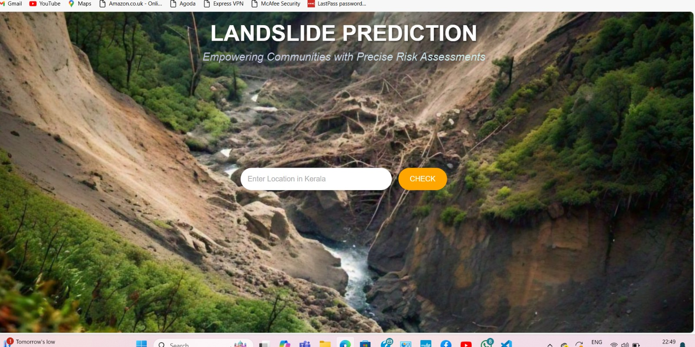
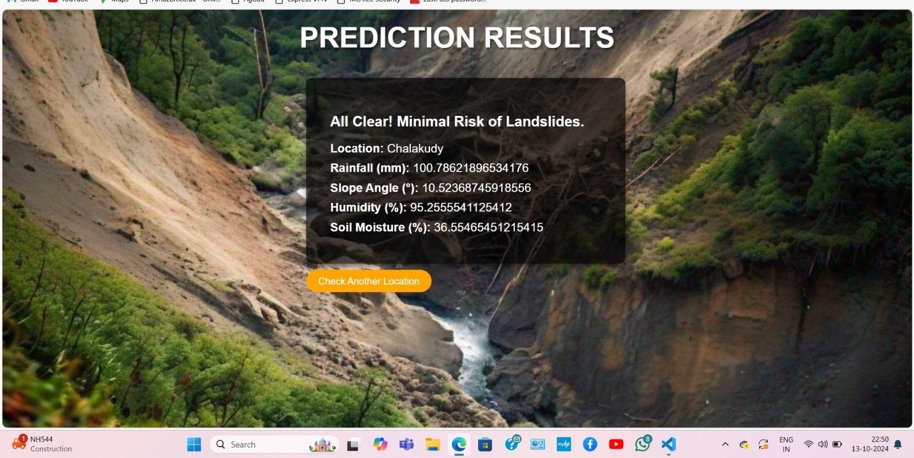
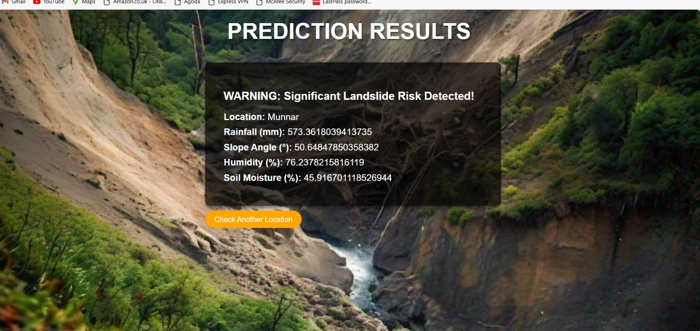
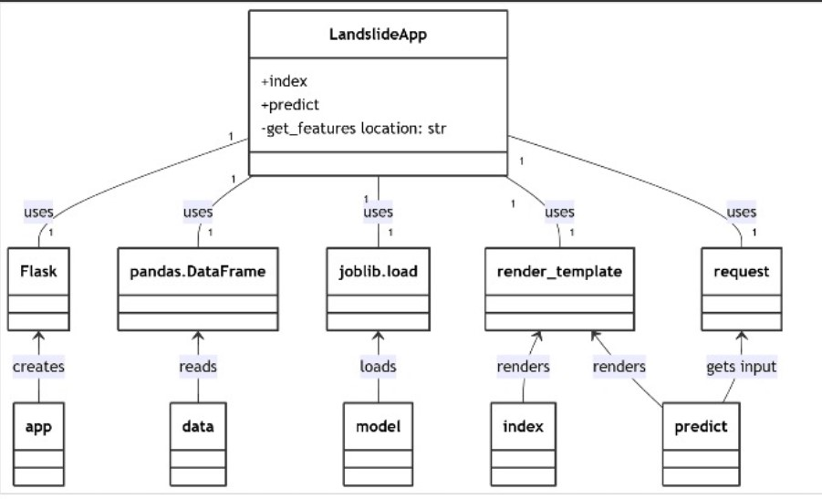

# LANDSLIDE PREDICTION SYSTEM 🎯

## Basic Details
### Team Name: Heisters

### Team Members
- Team Lead: Anjana varghese - Sahrdaya college of engineering and technology
- Member 2: Anjana m s - Sahrdaya college of engineering and technology
- Member 3: Arya Ajay - Sahrdaya college of engineering and technology
### Project Description
A Landslide Prediction System that uses advanced algorithms to let people know when it's time to cancel their mountain hike plans—or maybe just grab a helmet!

### The Problem (that doesn't exist)
Ever found yourself standing on a hill and wondering, "Will this slope decide to slide me down today?" We're solving that age-old (nonexistent) problem by predicting landslides before they start! Now you can confidently say, "Not today, gravity!"

### The Solution (that nobody asked for)
Using complex algorithms, location data, and a sprinkle of "science," our system gives you the power to detect landslides before they ruin your day! Just type in your location, hit CHECK, and boom—your phone tells you whether to hike bravely or run for cover! Because who doesn't want a virtual fortune-teller for landslides?

## Technical Details
### Technologies/Components Used
For Software:

Languages used: Python, HTML 
Frameworks used: Flask (for the web application) 
Libraries used: Pandas (for data handling), Joblib (for model loading) 
Tools used: Flask development server, Jupyter Notebook (for model training and testing) 

### Implementation
For Software

# Installation

Install required Python packages: 
pip install flask pandas joblib 

Ensure landslide_model.pkl and landslide_data.csv are in the project directory. 
# Run
Start the Flask app with: 
python app.py 
### Project Documentation
For Software
Architecture: The application accepts a location input, retrieves corresponding environmental features, and uses a machine learning model to predict landslide risk. 
Model Details: The app uses a machine learning model (e.g., logistic regression, decision tree) trained on environmental factors like rainfall, slope, humidity, and soil moisture. 
Error Handling: If the entered location is not found in the dataset, the app returns an error message: "Location not found in the dataset." This ensures graceful handling of user errors or incomplete data. 

# Screenshots 
1. Main Page

 This screenshot shows the main page of the Landslide Prediction System, where users can enter a location to check landslide risk.

2. Prediction Result - Minimal Risk

   
   
  This screenshot shows the result page with a message indicating minimal risk of landslides for a given location.

4. Prediction Result - High Risk Warning
   
   
   
 This screenshot displays a high-risk warning message for landslides based on the input location, alerting users to significant landslide risk.

# Diagrams
 
 This diagram illustrates the workflow/architecture of the Landslide Prediction System, showing the process from user input to model prediction and result display.
## Team Contributions
Anjana varghese: Conducted data collection and preprocessing for the landslide model. 
Anjana M S: Developed the web application and integrated the prediction functionality. 
Arya Ajay: Managed model training and evaluation, ensuring accurate predictions. 

Made with ❤️ at TinkerHub Useless Projects 

